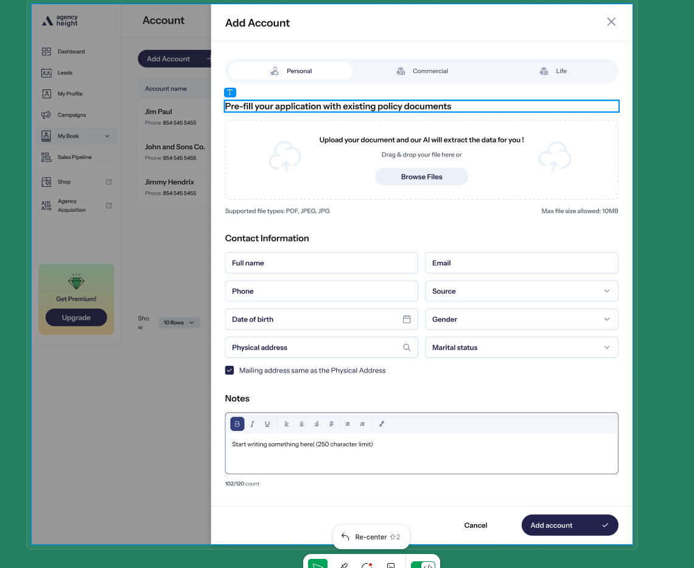

<p align="center">
  
  
  
</p>

<h1 align="center">
  <br>
  ⚡ Claude Usage
  <br>
</h1>

<p align="center">
  <strong>Your Claude usage, always visible.</strong>
  <br>
  A native macOS menu bar app that shows your Claude AI session and weekly usage limits in real time.
  <br>
  Zero setup required — auto-detects your Claude Code credentials.
</p>

<p align="center">
  <a href="#install">Install</a> &bull;
  <a href="#how-it-works">How It Works</a> &bull;
  <a href="#features">Features</a> &bull;
  <a href="#building">Building</a> &bull;
  <a href="#license">License</a>
</p>

---

## What It Looks Like

<p align="center">
  
  <br>
  <em>Always visible in your menu bar</em>
</p>

<p align="center">
  
  <br>
  <em>Click to see the full breakdown — session limits, weekly limits, and reset timers</em>
</p>

## Install

**Prerequisites:** macOS 14+ and [Claude Code](https://claude.ai/code) installed and authenticated.

```bash
# Clone and build
git clone https://github.com/bishojbk/claude-usage.git
cd claude-usage
make install

# Make sure Claude Code is authenticated
claude auth login
```

Then open **Claude Usage** from `/Applications` or Spotlight. It appears as `⚡` in your menu bar.

### Uninstall

```bash
make uninstall
```

## How It Works

1. **Reads your existing credentials** — If you've authenticated with `claude auth login`, your OAuth token is already in the macOS Keychain. Claude Usage reads it once at startup. No extra login, no API keys, no browser cookies.

2. **Pings the Anthropic API** — Every few minutes, sends a minimal 1-token Haiku request to `api.anthropic.com`. Cost is essentially zero.

3. **Parses rate-limit headers** — Both `200` and `429` responses include headers with your exact usage:
   - `anthropic-ratelimit-unified-5h-utilization` — session usage (0.0–1.0)
   - `anthropic-ratelimit-unified-7d-utilization` — weekly usage (0.0–1.0)
   - Reset timestamps for both windows

4. **Displays in your menu bar** — Compact percentage at a glance. Click for the full breakdown with progress bars and reset timers.

## Features

| Feature | Description |
|---|---|
| **Zero-config auth** | Auto-detects Claude Code OAuth credentials from macOS Keychain |
| **Menu bar display** | Session usage percentage always visible, color-coded (blue/orange/red) |
| **Full breakdown** | Click to see session limits, weekly limits, Sonnet-specific usage, reset timers |
| **Smart alerts** | macOS notifications when usage crosses configurable thresholds |
| **Near-zero cost** | Each poll is a single Haiku token (~$0.000001) |
| **Native Swift** | Built with SwiftUI. ~2MB binary. No Electron, no web views |
| **Privacy first** | Credentials never leave your machine. Fully open source |

## Building

```bash
# Debug build
swift build

# Release build + app bundle
make app

# Install to /Applications
make install

# Run without installing
make run

# Clean
make clean
```

### Project Structure

```
ClaudeUsage/
├── Package.swift
├── Makefile
├── Info.plist
├── ClaudeUsage/
│   ├── App/
│   │   ├── ClaudeUsageApp.swift         # @main entry
│   │   └── AppDelegate.swift            # NSStatusItem + popover
│   ├── Views/
│   │   ├── MenuBarView.swift            # Main popover panel
│   │   └── SettingsView.swift           # Settings sheet
│   ├── Models/
│   │   ├── AppState.swift               # Observable state
│   │   └── UsageData.swift              # Usage/limit models + API response
│   └── Services/
│       ├── AnthropicAPIService.swift     # Haiku ping + header parsing
│       ├── KeychainService.swift         # Claude Code credential reader
│       └── UsagePollingService.swift     # Timer + notifications
└── website/
    └── index.html                       # Landing page
```

## Configuration

Click the **gear icon** in the popover to access settings:

- **Refresh interval** — 1, 2, 5, or 10 minutes (default: 5)
- **Auth status** — Shows whether Claude Code credentials are detected

## Troubleshooting

**"Not Connected" shown**
- Run `claude auth login` in your terminal and authenticate
- Relaunch Claude Usage

**Password prompt on launch**
- macOS asks once per launch to access Claude Code's Keychain entry
- Click "Always Allow" to stop future prompts for this app

**Usage shows 0%**
- Make sure you've used Claude recently (session window is 5 hours)
- Click the refresh button in the popover

## License

MIT
